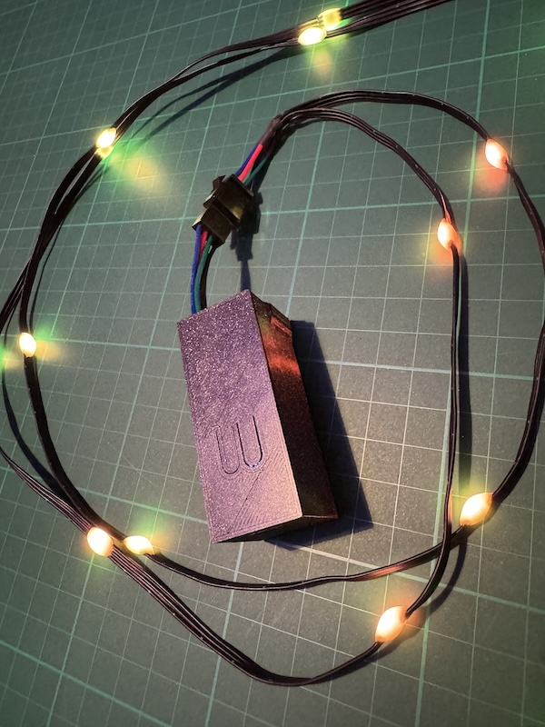
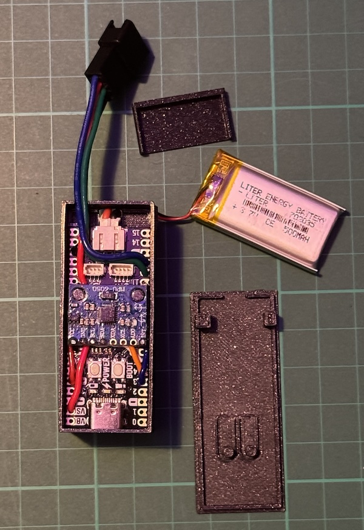
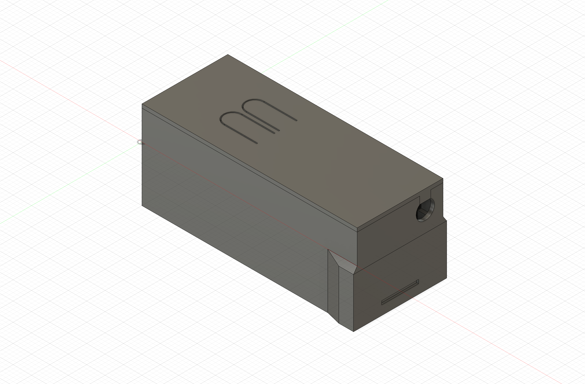

# Lenkdrachen LED Beleuchtung mit Bewegungsreaktion (Kite LED Lighting with Motion Response)

## Deutsch *(Version 2.0)*

Dieses Projekt realisiert eine dynamische LED-Beleuchtung für Lenkdrachen, die auf deren Bewegungen und Beschleunigungen reagiert. Die Farbe der LEDs wird durch den aktuellen Winkel des Drachens bestimmt, während die Geschwindigkeit der Animationsabläufe von der Bewegungsgeschwindigkeit des Drachens abhängt.

[Bedienungsanleitung](manual/manual_de.md)

### Features

* Helligkeit in 6 Stufen (95 → 255 in Schritten von 32) einstellbar – beeinflusst die Akkulaufzeit
* 13 reaktionsfreudige Patterns/Animationen, teilweise bewegungsabhängig
* Ladestandsanzeige über das LED-Band inkl. Ladefortschritt während USB-Verbindung
* Automatisches Speichern von Muster & Helligkeit (EEPROM) – Start mit den letzten Einstellungen
* **Neues Command Line Interface:** Muster aktivieren/deaktivieren, Sensor-Empfindlichkeit und LED-Parameter einstellen, Konfiguration jederzeit speichern

### Verwendete Technologien und Komponenten

* **Mikrocontroller:** [Pimoroni Pico Lipo](https://shop.pimoroni.com) **(mit integriertem Akku-Management)**
* **Akku:** 500mAh LiPo Akku
* **Gyroskop/Beschleunigungsmesser:** [MPU6050 Modul](https://www.reichelt.de/de/de/shop/produkt/entwicklerboards_-_beschleunigung_gyroskop_3-achsen_mpu-6050-253987)
* **LED-Strip:** Zwei WS2812B Fairyight LED-Stränge mit je 25 Pixeln (50 Pixel gesamt)
* **Programmiersprache:** C++
* **Entwicklungsumgebung (optional):** [PlatformIO](https://platformio.org/) (für eigene Anpassungen)
* **Gewicht:** ca. 60 Gramm (Controller mit Gehäuse ca. 30 Gramm, LED-Strip ca. 30 Gramm)

### Hardware





#### 3D-Druck Gehäuse

Für dieses Projekt steht ein Gehäuse zur Verfügung, das mit einem 3D-Drucker gefertigt werden kann. Die Dateien für den 3D-Druck (im 3MF- und STEP-Format) sowie eine Vorschau des Gehäuses befinden sich im Verzeichnis `case/` dieses Repositorys.



#### Verdrahtung

Die folgende Tabelle zeigt die Verbindungen zwischen dem Pimoroni Pico Lipo, dem LED-Strip und dem MPU6050:

| Komponente          | Pin am Mikrocontroller |
| ------------------ | ---------------------- |
| LED Strip +        | VS (VSYS)              |
| LED Strip -        | GND                    |
| LED Strip 1 DIN    | GP12                   |
| LED Strip 2 DIN    | GP13                   |
| MPU6050 VCC        | 3V3\_OUT               |
| MPU6050 GND        | GND                    |
| MPU6050 INT        | GP3                    |
| MPU6050 SDA        | GP4                    |
| MPU6050 SCL        | GP5                    |

### Stromversorgung und Laufzeit

Das System wird über einen integrierten 500mAh LiPo Akku betrieben. Der Pimoroni Pico Lipo verfügt über ein integriertes Akku-Management, das ein sicheres Laden und Entladen des Akkus gewährleistet.

**Aufladen:** Das Aufladen erfolgt bequem über den USB-C Anschluss am Mikrocontroller. Während des Ladevorgangs zeigt das LED-Band den Ladefortschritt als Balken, eine rote LED blinkt zur Bestätigung. Voll geladen bedeutet fünf blaue LEDs und die rote Status-LED erlischt.

**Laufzeit:** Die Akkulaufzeit beträgt, abhängig von der gewählten LED-Animation und der Helligkeit, zwischen 1 und 2,5 Stunden. Nach dem Abziehen vom USB springt das System automatisch zurück zum zuletzt aktiven Muster.

### Bedienung

Der Controller verfügt über zwei Tasten:

* **Linker Button:** Schaltet den Controller ein und aus.
* **Rechter Button:** Hat drei Funktionen:
    * **Doppelklick (2x kurz hintereinander):** Schaltet zyklisch durch die 13 Animationsmuster.
    * **Kurz drücken (Shortpress):** Schaltet durch die 6 Helligkeitsstufen (95 → 127 → 159 → 191 → 223 → 255 → 95). Auf Wunsch lässt sich per CLI (`brightness-mode battery`) einstellen, dass diese Änderung nur im Akku-/Batteriemodus möglich ist.
    * **Gedrückt halten (Longpress):** Zeigt für 5 Sekunden den Akkuladestand an. Bis zu fünf LEDs dienen als Balkenanzeige; eine blaue Markierung blinkt während der Messung.

**Initialisierung & Speicherfunktion:** Nach dem Einschalten führt der Controller eine kurze Kalibrierung des MPU6050 durch. Während dieser Kalibrierungsphase (einige Sekunden) muss der Controller ruhig gehalten werden. Sobald die Einmessung abgeschlossen ist, schalten sich die LEDs ein. Der zuletzt verwendete Modus und die Helligkeit werden automatisch aus dem Speicher geladen.

### Command Line Interface

Zusätzlich zum Button steht eine serielle Kommandozeile (USB, 115200 Baud) zur Verfügung. Nach dem Verbinden über einen Terminal oder den PlatformIO-Monitor können folgende Befehle genutzt werden:

| Befehl | Beschreibung |
| ------ | ------------ |
| `pattern-list` | Zeigt alle Muster mit ID und Status an. |
| `pattern-enable <ID[,ID...]\|Name\|all>` | Aktiviert ein oder mehrere Muster (IDs kommasepariert). `all` reaktiviert alle. |
| `pattern-disable <ID[,ID...]\|Name\|all>` | Deaktiviert Muster (mindestens ein Pattern muss aktiv bleiben). |
| `set-accel <0-3\|2\|4\|8\|16>` | Setzt den Beschleunigungsmesserbereich (Index oder ±g). |
| `set-gyro <0-3\|250\|500\|1000\|2000>` | Setzt den Gyroskopbereich (Index oder °/s). |
| `set-smoothing <1-100>` | Legt fest, wie viele Messwerte für das Bewegungs-Smoothing genutzt werden. |
| `led-param <name> <wert>` | Passt Parameter wie `bloodHue`, `bloodSat`, `flowDirection`, `cycleLength`, `pulseLength`, `pulseOffset`, `baseBrightness`, `running9Tail`, `running11JerkThreshold`, `running11WaveSpacing`, `running12Deadband` an. |
| `config-show` | Gibt die aktuelle Konfiguration inklusive Sensorbereiche und LED-Parameter aus. |
| `config-save` | Speichert die aktuelle Konfiguration sofort im EEPROM (ansonsten erfolgt dies alle 5 Minuten automatisch). |
| `reset` | Startet den RP2040 neu (nützlich nach Konfigurationsänderungen). |
| `pattern-indicator <on/off>` | Aktiviert/deaktiviert das Anzeigen der Musternummer vor jedem Effekt. |
| `pattern-indicator-param <name> <wert>` | Passt `blink`, `duration`, `maxleds`, `hue`, `mode`, `dynamic` an (Blinkanzahl = Anzahl leuchtender LEDs). |
| `brightness-mode <battery\|anywhere>` | Legt fest, ob die Helligkeit nur in der Akkuanzeige oder überall per Button geändert werden darf. |
| `battery-display <ms>` | Setzt die Anzeigedauer der Akkuanzeige in Millisekunden (1 000–15 000). |
| `config-reset` | Setzt alle Einstellungen auf Werkseinstellungen zurück. |

Mehrere IDs können kommasepariert (oder mit Leerzeichen) angegeben werden, z. B. `pattern-enable 1,3,5`. Muster können sowohl über die Zahlen `1…13` als auch über ihre Namen (`running`, `running2`, … `running13`) adressiert werden. Änderungen an Sensoren, Smoothing oder LED-Parametern werden sofort aktiv, die Werte landen beim nächsten automatischen Speichern oder per `config-save` dauerhaft im Speicher.

### Einfache Installation über .UF2-Datei

Für eine schnelle Inbetriebnahme kann eine fertig kompilierte `.uf2`-Datei verwendet werden. Gehe dazu wie folgt vor:

1.  **Boot-Modus aktivieren:** Halte den **rechten Knopf** auf dem Pimoroni Pico Lipo gedrückt, während du ihn über USB mit deinem Computer verbindest. Dadurch versetzt du den Mikrocontroller in den Boot-Modus.

2.  **Laufwerk erkennen:** Dein Computer sollte nun ein neues Laufwerk mit dem Namen `RPI-RP2` oder ähnlich anzeigen.

3.  **`.uf2`-Datei kopieren:** Lade die Datei `firmware.uf2` aus dem Release-Bereich dieses Repositorys herunter und ziehe sie per Drag & Drop auf das erkannte `RPI-RP2`-Laufwerk.

4.  **Automatischer Neustart:** Sobald die Datei kopiert wurde, wird der Pico automatisch neu gestartet und die LED-Beleuchtung sollte aktiv sein.

### Einrichtung und Start (für Entwickler und eigene Anpassungen)

Wenn du die Software selbst kompilieren oder Anpassungen vornehmen möchtest, sind folgende Schritte notwendig:

1.  **Installation von PlatformIO:** Stelle sicher, dass PlatformIO auf deinem System installiert ist. Eine detaillierte Anleitung findest du auf der [PlatformIO Webseite](https://platformio.org/install).

2.  **Klonen des Repositorys:** Klone dieses GitHub-Repository auf deinen lokalen Rechner.
    ```bash
    git clone [https://github.com/SunnyCodes86/nightkite-multi.git](https://github.com/SunnyCodes86/nightkite-multi.git)
    cd nightkite-multi
    ```

3.  **Konfiguration in `platformio.ini` (optional):** Überprüfe die `platformio.ini`-Datei im Projektverzeichnis. Hier sind die Umgebungsbedingungen für den Pimoroni Pico Lipo und die benötigten Bibliotheken definiert. Passe diese Datei bei Bedarf an deine spezifischen Bedürfnisse an.

4.  **Bibliotheken installieren:** PlatformIO sollte die benötigten Bibliotheken automatisch herunterladen und installieren, wenn du das Projekt kompilierst. Stelle sicher, dass in deiner `platformio.ini` die notwendigen Bibliotheken unter `lib_deps` aufgeführt sind.

5.  **Kompilieren und Hochladen:** Verbinde deinen Pimoroni Pico Lipo über USB mit deinem Computer. Nutze dann PlatformIO, um das Projekt zu kompilieren und auf den Mikrocontroller hochzuladen. Dies kann in der PlatformIO IDE oder über die Kommandozeile erfolgen:
    ```bash
    pio run -t upload
    ```

6.  **Los geht's!** Sobald die Software hochgeladen ist (entweder über `.uf2` oder PlatformIO) und die Hardware korrekt verbunden ist, sollte die LED-Beleuchtung deines Lenkdrachens auf dessen Bewegungen reagieren.

### Beispiele für die Nutzung

tbd

### Lizenz

Dieses Projekt ist unter der [MIT Lizenz](LICENSE.txt) lizenziert.

---

## English *(Version 2.0)*

This project implements dynamic LED lighting for kites that reacts to their movements and accelerations. The color of the LEDs is determined by the current angle of the kite, while the speed of the animation sequences depends on the kite's speed of motion.

[User Manual](manual/manual_en.md)

### Features

* Six brightness levels (95 → 255 in steps of 32) impact the battery runtime
* 13 motion-reactive patterns/animations with mirrored dual-strip output
* Battery level indicator on the LED strip including charging progress while on USB power
* Automatic persistence of pattern & brightness in EEPROM for seamless restarts
* **Command Line Interface:** enable/disable patterns, tune sensor sensitivity and LED parameters, trigger manual config saves

### Used Technologies and Components

* **Microcontroller:** [Pimoroni Pico Lipo](https://shop.pimoroni.com) **(with integrated battery management)**
* **Battery:** 500mAh LiPo battery
* **Gyroscope/Accelerometer:** [MPU6050 Module](https://www.reichelt.de/de/en/shop/product/developer-boards-acceleration-gyroscope-3-axes-mpu-6050-253987)
* **LED Strips:** Two WS2812B Fairyight strings with 25 pixels each (50 pixels total)
* **Programming Language:** C++
* **Development Environment (optional):** [PlatformIO](https://platformio.org/) (for own adaptations)
* **Weight:** approx. 60 grams (controller with case approx. 30 grams, LED strip approx. 30 grams)

### Hardware


#### 3D-Printed Case

An optional case for this project is available and can be manufactured with a 3D printer. The files for 3D printing (in 3MF and STEP format) as well as a preview of the case can be found in the `case/` directory of this repository.


#### Wiring

The following table shows the connections between the Pimoroni Pico Lipo, the LED strip, and the MPU6050:

| Component          | Pin on Microcontroller |
| ------------------ | ---------------------- |
| LED Strip +        | VS (VSYS)              |
| LED Strip -        | GND                    |
| LED Strip 1 DIN    | GP12                   |
| LED Strip 2 DIN    | GP13                   |
| MPU6050 VCC        | 3V3\_OUT               |
| MPU6050 GND        | GND                    |
| MPU6050 INT        | GP3                    |
| MPU6050 SDA        | GP4                    |
| MPU6050 SCL        | GP5                    |

### Power Supply and Runtime

The system is powered by an integrated 500mAh LiPo battery. The Pimoroni Pico Lipo features integrated battery management, ensuring safe charging and discharging of the battery.

**Charging:** Charging is done via the USB-C port on the microcontroller. While charging, the LED strip displays a progress bar and a red LED blinks to indicate active charging. When five blue LEDs remain and the red LED switches off, the battery is fully charged.

**Runtime:** Battery runtime is between 1 and 2.5 hours, depending on the selected LED animation and brightness. After unplugging USB power the controller automatically resumes the last active pattern.

### Operation

The controller has two buttons:

* **Left Button:** Turns the controller on and off.
* **Right Button:** Provides three functions:
    * **Double click (two quick presses):** Cycles through the 13 animation patterns.
    * **Short press:** Cycles through the six brightness levels (95 → 127 → 159 → 191 → 223 → 255 → 95). This can optionally be limited to the battery screen via the `brightness-mode battery` CLI command.
    * **Long press:** Shows the battery level for 5 seconds. Up to five LEDs form a bar indicator while a blue marker LED blinks during the readout.

**Initialization & Persistence:** After powering on, the controller performs a short calibration of the MPU6050. Keep the controller still during this calibration phase (a few seconds). Once complete the LEDs will turn on, resuming the last used pattern and brightness from EEPROM.

### Command Line Interface

The USB serial port (115200 baud) exposes a CLI for advanced configuration. Typical commands are:

| Command | Description |
| ------- | ----------- |
| `pattern-list` | Shows all patterns with their IDs and enabled state. |
| `pattern-enable <ID[,ID...]\|Name\|all>` | Enables one or multiple patterns (comma-separated IDs). `all` restores every pattern. |
| `pattern-disable <ID[,ID...]\|Name\|all>` | Disables patterns (at least one pattern must remain enabled). |
| `set-accel <0-3\|2\|4\|8\|16>` | Sets the accelerometer range by index or ±g value. |
| `set-gyro <0-3\|250\|500\|1000\|2000>` | Sets the gyroscope range by index or °/s value. |
| `set-smoothing <1-100>` | Sets how many samples are used for motion smoothing. |
| `led-param <name> <value>` | Adjusts effect parameters (`bloodHue`, `bloodSat`, `flowDirection`, `cycleLength`, `pulseLength`, `pulseOffset`, `baseBrightness`, `running9Tail`, `running11JerkThreshold`, `running11WaveSpacing`, `running12Deadband`). |
| `config-show` | Prints the current configuration including sensor ranges and LED parameters. |
| `config-save` | Stores the current configuration immediately (otherwise auto-save runs every 5 minutes). |
| `reset` | Reboots the RP2040 so changes take effect cleanly. |
| `pattern-indicator <on/off>` | Enables or disables the pre-pattern number blink. |
| `pattern-indicator-param <name> <value>` | Adjusts indicator `blink`, `duration`, `maxleds`, `hue`, `mode`, `dynamic` (blink count matches the LED count). |
| `brightness-mode <battery\|anywhere>` | Sets whether brightness changes via button are only allowed in the battery view or everywhere. |
| `battery-display <ms>` | Sets the battery-screen display duration in milliseconds (1 000–15 000). |
| `config-reset` | Resets the entire configuration to defaults. |

You can pass multiple IDs separated by commas or spaces, e.g. `pattern-disable 2,4,6`. Patterns can be referenced either by their numeric IDs (1…13) or by the internal names (`running`, `running2`, …, `running13`). Changes to sensors, smoothing, or LED parameters take effect instantly and persist after the next automatic or manual save.

### Easy Installation via .UF2 File

For quick setup, a pre-compiled `.uf2` file can be used. Proceed as follows:

1.  **Activate Boot Mode:** Press and hold the **right button** on the Pimoroni Pico Lipo while connecting it to your computer via USB. This puts the microcontroller into boot mode.

2.  **Recognize Drive:** Your computer should now display a new drive named `RPI-RP2` or similar.

3.  **Copy `.uf2` File:** Download the `firmware.uf2` file from the release section of this repository and drag and drop it onto the recognized `RPI-RP2` drive.

4.  **Automatic Restart:** Once the file is copied, the Pico will restart automatically, and the LED lighting should be active.

### Setup and Start (for Developers and Own Adaptations)

If you want to compile the software yourself or make adjustments, the following steps are necessary:

1.  **Install PlatformIO:** Make sure PlatformIO is installed on your system. Detailed instructions can be found on the [PlatformIO website](https://platformio.org/install).

2.  **Clone the Repository:** Clone this GitHub repository to your local machine.
    ```bash
    git clone [https://github.com/SunnyCodes86/nightkite-multi.git](https://github.com/SunnyCodes86/nightkite-multi.git)
    cd nightkite-multi
    ```

3.  **Configuration in `platformio.ini` (optional):** Check the `platformio.ini` file in the project directory. Here, the environment settings for the Pimoroni Pico Lipo and the required libraries are defined. Adjust this file to your specific needs if necessary.

4.  **Install Libraries:** PlatformIO should automatically download and install the required libraries when you compile the project. Ensure that the necessary libraries are listed under `lib_deps` in your `platformio.ini`.

5.  **Compile and Upload:** Connect your Pimoroni Pico Lipo to your computer via USB. Then use PlatformIO to compile the project and upload it to the microcontroller. This can be done in the PlatformIO IDE or via the command line:
    ```bash
    pio run -t upload
    ```

6.  **Let's Go!** Once the software is uploaded (either via `.uf2` or PlatformIO) and the hardware is correctly connected, the LED lighting of your kite should react to its movements.

### Usage Examples

tbd

### License

This project is licensed under the [MIT License](LICENSE.txt).

---
