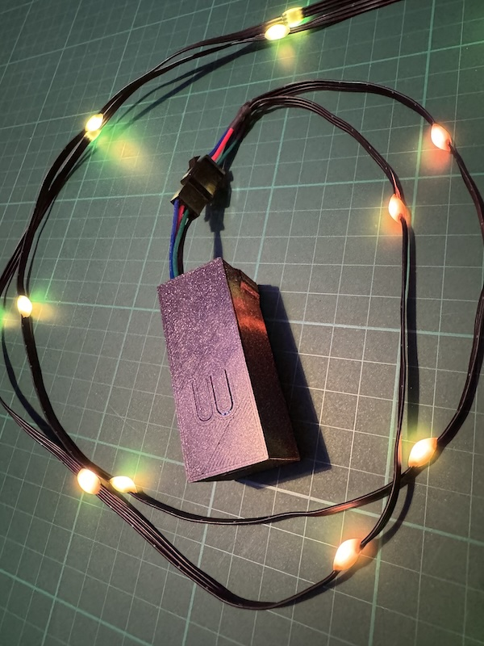
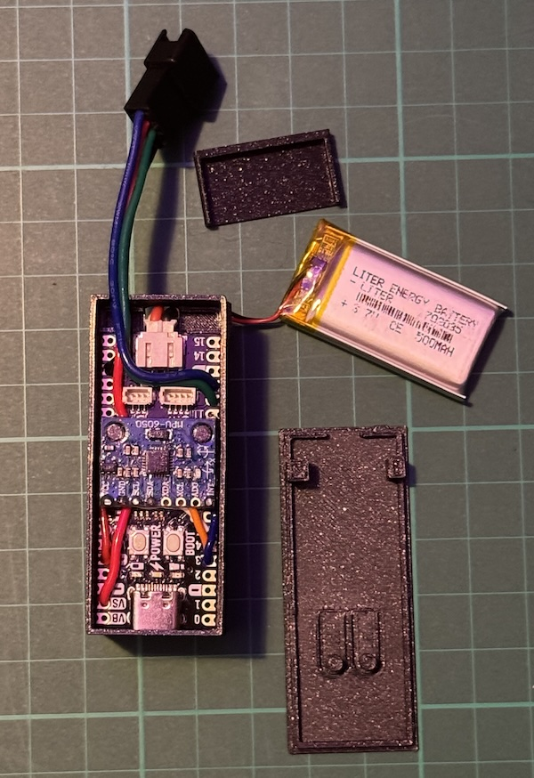
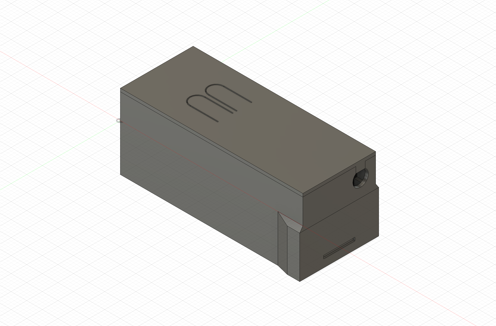

# Lenkdrachen LED Beleuchtung mit Bewegungsreaktion (Kite LED Lighting with Motion Response)

## Deutsch *(Version 3.0)*

Dieses Projekt realisiert eine dynamische LED-Beleuchtung für Lenkdrachen, die auf deren Bewegungen und Beschleunigungen reagiert. Die Farbe der LEDs wird durch den aktuellen Winkel des Drachens bestimmt, während die Geschwindigkeit der Animationsabläufe von der Bewegungsgeschwindigkeit des Drachens abhängt.

[Bedienungsanleitung](manual/manual_de.md)

### Features

* Helligkeit in 6 Stufen (95 → 255 in Schritten von 32) einstellbar – beeinflusst die Akkulaufzeit
* 22 Patterns/Animationen, teilweise bewegungsabhängig
* Autoplay zum automatischen Durchschalten durch aktivierte Pattern mit global einstellbarem Intervall
* Ladestandsanzeige über das LED-Band inkl. Ladefortschritt während USB-Verbindung
* Persistente Konfiguration in EEPROM: Pattern, Helligkeit, Strip-Länge, Motion-Smoothing, Sensor-Range, Boot-Kalibrierung, aktivierte/invertierte Pattern, Autoplay und MPU-Offsets
* USB-CLI für Status, Diagnose, Timing und Kalibrierung

### Verwendete Technologien und Komponenten

* **Mikrocontroller:** [Pimoroni Pico Lipo](https://shop.pimoroni.com) **(mit integriertem Akku-Management)**
* **Akku:** 500mAh LiPo Akku
* **Gyroskop/Beschleunigungsmesser:** [MPU6050 Modul](https://www.reichelt.de/de/de/shop/produkt/entwicklerboards_-_beschleunigung_gyroskop_3-achsen_mpu-6050-253987)
* **LED-Strip:** Zwei WS2812B Fairyight LED-Stränge mit je 25 Pixeln (50 Pixel gesamt)
* **Programmiersprache:** C++
* **Entwicklungsumgebung (optional):** [PlatformIO](https://platformio.org/) (für eigene Anpassungen)
* **Gewicht:** ca. 60 Gramm (Controller mit Gehäuse ca. 30 Gramm, LED-Strip ca. 30 Gramm)

### Hardware





#### 3D-Druck Gehäuse

Für dieses Projekt steht ein Gehäuse zur Verfügung, das mit einem 3D-Drucker gefertigt werden kann. Die Dateien für den 3D-Druck (im 3MF- und STEP-Format) sowie eine Vorschau des Gehäuses befinden sich im Verzeichnis `case/` dieses Repositorys.



#### Verdrahtung

Die folgende Tabelle zeigt die Verbindungen zwischen dem Pimoroni Pico Lipo, dem LED-Strip und dem MPU6050:

| Komponente          | Pin am Mikrocontroller |
| ------------------ | ---------------------- |
| LED Strip +        | VS (VSYS)              |
| LED Strip -        | GND                    |
| LED Strip 1 DIN    | GP12                   |
| LED Strip 2 DIN    | GP13                   |
| MPU6050 VCC        | 3V3\_OUT               |
| MPU6050 GND        | GND                    |
| MPU6050 INT        | GP3                    |
| MPU6050 SDA        | GP4                    |
| MPU6050 SCL        | GP5                    |

### Stromversorgung und Laufzeit

Das System wird über einen integrierten 500mAh LiPo Akku betrieben. Der Pimoroni Pico Lipo verfügt über ein integriertes Akku-Management, das ein sicheres Laden und Entladen des Akkus gewährleistet.

**Aufladen:** Das Aufladen erfolgt bequem über den USB-C Anschluss am Mikrocontroller. Während des Ladevorgangs zeigt das LED-Band den Ladefortschritt als Balken, eine rote LED blinkt zur Bestätigung. Voll geladen bedeutet fünf blaue LEDs und die rote Status-LED erlischt erst nahe der vollen Zellspannung (Firmware-Schwelle aktuell: ≥ 4.20 V).

**Laufzeit:** Die Akkulaufzeit beträgt, abhängig von der gewählten LED-Animation und der Helligkeit, zwischen 1 und 2,5 Stunden. Nach dem Abziehen vom USB springt das System automatisch zurück zum zuletzt aktiven Muster.

### Bedienung

Der Controller verfügt über zwei Tasten:

* **Linker Button:** Schaltet den Controller ein und aus.
* **Rechter Button:** Hat mehrere Funktionen:
    * **Doppelklick (2x kurz hintereinander):** Schaltet im normalen Betrieb zyklisch durch die 22 Animationsmuster.
    * **Kurz drücken (Shortpress):** Nur in der Akkuanzeige. Schaltet durch die 6 Helligkeitsstufen (95 → 127 → 159 → 191 → 223 → 255 → 95).
    * **Gedrückt halten (Longpress):** Öffnet die Akkuanzeige. Bis zu fünf LEDs dienen als Balkenanzeige; auf dem zweiten Strip blinkt eine blaue Markierung, gelbe LEDs zeigen die Helligkeitsstufe, und zwei weitere Status-LEDs zeigen Autoplay (`grün/grün` = an, `rot/rot` = aus).
    * **Doppelklick in der Akkuanzeige:** Schaltet Autoplay global ein oder aus.

**Initialisierung & Speicherfunktion:** Nach dem Einschalten lädt der Controller die gespeicherte Konfiguration und führt standardmäßig eine kurze MPU6050-Quick-Kalibrierung durch. Während dieser Phase (einige Sekunden) sollte der Controller ruhig gehalten werden. Die Boot-Kalibrierung kann über die CLI deaktiviert werden. Sobald die Initialisierung abgeschlossen ist, schalten sich die LEDs ein. Die zuletzt gespeicherten Werte werden automatisch geladen.

### Einfache Installation über .UF2-Datei

Für eine schnelle Inbetriebnahme kann eine fertig kompilierte `.uf2`-Datei verwendet werden. Gehe dazu wie folgt vor:

1.  **Boot-Modus aktivieren:** Halte den **rechten Knopf** auf dem Pimoroni Pico Lipo gedrückt, während du ihn über USB mit deinem Computer verbindest. Dadurch versetzt du den Mikrocontroller in den Boot-Modus.

2.  **Laufwerk erkennen:** Dein Computer sollte nun ein neues Laufwerk mit dem Namen `RPI-RP2` oder ähnlich anzeigen.

3.  **`.uf2`-Datei kopieren:** Lade die Datei `firmware.uf2` aus dem Release-Bereich dieses Repositorys herunter und ziehe sie per Drag & Drop auf das erkannte `RPI-RP2`-Laufwerk.

4.  **Automatischer Neustart:** Sobald die Datei kopiert wurde, wird der Pico automatisch neu gestartet und die LED-Beleuchtung sollte aktiv sein.

### Einrichtung und Start (für Entwickler und eigene Anpassungen)

Wenn du die Software selbst kompilieren oder Anpassungen vornehmen möchtest, sind folgende Schritte notwendig:

1.  **Installation von PlatformIO:** Stelle sicher, dass PlatformIO auf deinem System installiert ist. Eine detaillierte Anleitung findest du auf der [PlatformIO Webseite](https://platformio.org/install).

2.  **Klonen des Repositorys:** Klone dieses GitHub-Repository auf deinen lokalen Rechner.
    ```bash
    git clone [https://github.com/SunnyCodes86/nightkite-multi.git](https://github.com/SunnyCodes86/nightkite-multi.git)
    cd nightkite-multi
    ```

3.  **Konfiguration in `platformio.ini` (optional):** Überprüfe die `platformio.ini`-Datei im Projektverzeichnis. Hier sind die Umgebungsbedingungen für den Pimoroni Pico Lipo und die benötigten Bibliotheken definiert. Passe diese Datei bei Bedarf an deine spezifischen Bedürfnisse an.

4.  **Bibliotheken installieren:** PlatformIO sollte die benötigten Bibliotheken automatisch herunterladen und installieren, wenn du das Projekt kompilierst. Stelle sicher, dass in deiner `platformio.ini` die notwendigen Bibliotheken unter `lib_deps` aufgeführt sind.

5.  **Kompilieren und Hochladen:** Verbinde deinen Pimoroni Pico Lipo über USB mit deinem Computer. Nutze dann PlatformIO, um das Projekt zu kompilieren und auf den Mikrocontroller hochzuladen. Dies kann in der PlatformIO IDE oder über die Kommandozeile erfolgen:
    ```bash
    pio run -t upload
    ```

6.  **Los geht's!** Sobald die Software hochgeladen ist (entweder über `.uf2` oder PlatformIO) und die Hardware korrekt verbunden ist, sollte die LED-Beleuchtung deines Lenkdrachens auf dessen Bewegungen reagieren.

### USB-CLI

Sobald eine aktive serielle USB-Verbindung besteht, meldet sich die CLI mit:

```text
[NightKite CLI] USB connected. Type 'help'.
nk>
```

Verfügbare Kommandos:

```text
help
show
get <pattern|brightness|strip_length|smoothing|accel_range|gyro_range|boot_calibration>
get <pattern|brightness|strip_length|smoothing|accel_range|gyro_range|boot_calibration|autoplay|autoplay_interval|enabled_patterns|inverted_patterns>
set pattern <1..22>
set brightness <95|127|159|191|223|255>
set strip_length <10..35>
set smoothing <1..512>
set accel_range <2|4|8|16>
set gyro_range <250|500|1000|2000>
set boot_calibration <off|quick>
set autoplay <on|off>
set autoplay_interval <1..300>
patterns
enable_pattern <1..22[,id...]>
disable_pattern <1..22[,id...]>
invert_pattern <1..22[,id...]>
normal_pattern <1..22[,id...]>
battery
sensor
timing [reset]
offsets
calibrate quick
calibrate precise
save
load
defaults
reboot
restart
```

Hinweise:

* Daten-/Konfigurationskommandos antworten konsistent mit `OK ...` oder `ERR ...`, zum Beispiel `OK pattern=1`.
* `show` liefert alle relevanten Konfigurationswerte als kompakte `key=value`-Zeile.
* `show` enthält auch `autoplay`, `autoplay_interval`, `enabled_patterns` und `inverted_patterns`.
* `patterns` zeigt alle Pattern mit Status `on` oder `off`.
* `set pattern` schaltet das aktive Muster sofort um.
* `set pattern` darf auch deaktivierte Pattern direkt anwählen.
* Ein manueller Patternwechsel lässt Autoplay aktiv, setzt aber den Autoplay-Timer zurück.
* `set brightness` wirkt sofort.
* `set strip_length` wirkt sofort auf beide Strips.
* `enable_pattern` und `disable_pattern` steuern, welche Pattern per Doppelklick durchgeschaltet werden.
* Beide Befehle akzeptieren auch mehrere Pattern gleichzeitig als kommagetrennte Liste, z. B. `disable_pattern 3,5,7`.
* `invert_pattern` und `normal_pattern` steuern die Laufrichtung pro Pattern und speichern diese Einstellung persistent.
* Es muss immer mindestens ein Pattern aktiv bleiben.
* Autoplay verwendet nur aktivierte Pattern und kann persistent gespeichert werden.
* `smoothing`, `accel_range`, `gyro_range` und `boot_calibration` werden persistent gespeichert, greifen aber erst nach einem Neustart.
* `battery` zeigt den ADC-Rohwert, die berechnete Spannung sowie USB-/Serial-Status.
* `sensor` zeigt MPU-/DMP-Status und die konfigurierten bzw. aktiven Sensor-Ranges.
* `timing` zeigt `FastLED`-FPS, Loop-/Work-Zeiten, Frame-Budget und Samples in Mikrosekunden.
* `timing reset` setzt die Timing-Statistik (`avg`, `max`, `samples`) zurück, damit Pattern oder Änderungen direkt vergleichbar sind.
* `offsets` zeigt die aktuell verwendeten MPU-Offsets.
* `calibrate quick` führt die bisherige schnelle Kalibrierung aus und speichert die Offsets.
* `calibrate precise` nutzt den langsameren `IMU_Zero`-basierten Kalibrierpfad und speichert die Offsets.
* `calibrate quick` und `calibrate precise` starten mit `OK calibrate_started=1 ...` und enden mit `OK calibrate_finished=1 ...` plus finaler Offset-Zeile.
* `defaults` lädt nur Standardwerte in den Arbeitsspeicher. Für persistente Speicherung ist danach `save` nötig.

### Firmware 4.0 Alpha / NK4-Protokoll

Firmware `4.0.0-alpha.1` bereitet eine transportneutrale Kommando-Grundlage vor. Die bestehende USB-CLI bleibt der Human-/Legacy-Modus und damit der Fallback fuer Service, Diagnose und Kalibrierung. Zusaetzlich kann USB in einen maschinenlesbaren NK4-Modus wechseln:

```text
protocol machine
```

Danach antwortet die Firmware ohne Banner und Prompt nur noch mit NK4-Zeilen. NK4-Kommandos sind zeilenbasiert:

```text
NK4 seq=1 cmd=hello client=nightkite-link proto_min=4 proto_max=4
NK4 seq=2 cmd=info
NK4 seq=3 cmd=caps
NK4 seq=4 cmd=status
NK4 seq=10 cmd=get section=sync
NK4 seq=11 cmd=get section=wireless
NK4 seq=12 cmd=get section=play
NK4 seq=13 cmd=get section=patterns
NK4 seq=14 cmd=get section=config
NK4 seq=20 cmd=set name=NK-Left
NK4 seq=21 cmd=set pattern=8 brightness=159
NK4 seq=22 cmd=set sync_enabled=1 sync_group=1 sync_role=master
NK4 seq=23 cmd=set wireless_profile=long_range
NK4 seq=24 cmd=set play_mode=sync
NK4 seq=25 cmd=set strip_length=25 smoothing=100
NK4 seq=26 cmd=set enabled_mask=0x003FFFFF inverted_mask=0x00000000
NK4 seq=30 cmd=save
NK4 seq=40 cmd=patterns
NK4 seq=41 cmd=battery
NK4 seq=42 cmd=sensor
NK4 seq=43 cmd=timing
NK4 seq=44 cmd=offsets
NK4 seq=50 cmd=sync_arm group=1 pattern=8 brightness=159 start_in=750 phase=0
NK4 seq=52 cmd=sync_status
NK4 seq=51 cmd=sync_cancel
NK4 seq=60 cmd=test indicator=play_modes
```

Antworten verwenden das Format `NK4 seq=<id> ok ...` oder `NK4 seq=<id> err code=<code> msg=<short_message>`. Schutzkommandos brauchen eine Bestaetigung, z. B. `NK4 seq=70 cmd=defaults confirm=1` und `NK4 seq=71 cmd=reboot confirm=1`.

Die 4.0-Config erweitert die bestehende EEPROM-Konfiguration ohne die alten Adressen zu verschieben. Neu vorbereitet sind `device_uid`, `device_name`, `play_mode`, `boot_mode`, Sync-Einstellungen, Wireless-Einstellungen sowie kompakte Pattern-Masks. Beim ersten Start mit alter Config wird eine persistente UID erzeugt, daraus ein `short_id` abgeleitet und der Default-Name `NK-<short_id>` gesetzt. Die UID ist nicht per User-Kommando ueberschreibbar.

PlayMode ist jetzt als Steuerlogik mit `manual`, `autoplay` und `sync` angebunden. `manual` bleibt lokal auf dem aktuellen Pattern, `autoplay` nutzt das bestehende Autoplay-Verhalten, und `sync` bleibt lokal lauffaehig, auch wenn noch kein Funkmodul aktiv ist. Im Battery-View schaltet der vorhandene Mode-Button-Zyklus defensiv `manual -> autoplay -> sync -> manual`; der normale Pattern-Wechsel ausserhalb des Battery-Views bleibt erhalten. Die Status-Farben sind blau fuer manual, gruen fuer autoplay, cyan fuer sync follower, magenta fuer sync master und rot blinkend fuer sync error/no master. `NK4 cmd=test indicator=play_modes` zeigt diese Farben nacheinander auf dem Strip.

`SyncEngine` und `PatternClock` verwalten in diesem Alpha-Schritt lokale Sync-Zustaende, geplante lokale Starts, Pattern, Helligkeit, Phase und Pattern-Zeit. `sync_arm`, `sync_status` und `sync_cancel` funktionieren ohne Funktransport und loesen keine direkten EEPROM-Schreibvorgaenge aus; automatische Config-Saves werden waehrend aktivem lokalen Sync-Timing zurueckgestellt. Das vorbereitete Sync-Beacon-Modell uebertraegt nur Group, Flags, Sequenz, Pattern, Helligkeit, Phase, Beat und CRC; es werden keine LED-Frames ueber Funk gestreamt.

Zusaetzlich zu den Basis-Kommandos sind maschinenlesbare Diagnose- und Config-Kommandos verfuegbar: `battery`, `sensor`, `timing`, `offsets`, `get section=config`, `set strip_length`, `set smoothing`, `set accel_range`, `set gyro_range`, `set boot_calibration`, `set boot_mode`, `set enabled_mask`, `set inverted_mask`, `enable_pattern`, `disable_pattern`, `invert_pattern` und `normal_pattern`. Ungueltige Werte werden mit standardisierten `NK4 ... err code=...` Antworten abgewiesen.

RM2/BLE-Pins und Build-Flags sind vorbereitet (`NIGHTKITE_RM2`, `NIGHTKITE_BLE`), bleiben in den Standard-Builds aber deaktiviert. WLAN wird nicht als Firmware-Feature verwendet: kein `WiFi.begin`, kein Scan, kein Webserver.

Aktuelle RM2-Verkabelung am Pimoroni Pico LiPo 2:

| Pico LiPo 2 | RM2 Breakout |
| --- | --- |
| GP17 | BL_ON/WL_ON |
| GP18 | CS |
| GP19 | CLK |
| GP20 | DAT/WL_WAKE |
| 3V3 | 3V3 |
| GND | GND |

Das RM2 Breakout ist hart an die Aussenpads geloetet und nicht ueber den SP/CE-JST-Stecker verbunden. BL_ON und WL_ON sind auf dem Breakout hardwareseitig gebrueckt und haengen gemeinsam an GP17. GPIO0, GPIO1 und GPIO2 des RM2 Breakouts sind nicht verbunden.

Experimenteller BLE/RM2-Build:

```bash
platformio run -e pico2350_rm2_ble
platformio run -e pico2350_rm2_ble -t upload
```

Dieses Environment aktiviert `NIGHTKITE_BLE=1`, `NIGHTKITE_RM2=1`, den Arduino-Pico-Bluetooth-Stack und die dynamische CYW43/RM2-Pinbelegung fuer GP17-GP20. Der Build startet BLE-Advertising mit einem kompakten Namen wie `NK-<short_id>` und stellt experimentell einen NK4-over-BLE-GATT-Transport bereit. Sync-Beacons, Gruppensteuerung und Master/Follower-Funk sind noch nicht aktiv. WLAN wird nicht verwendet.

NightKite BLE-GATT:

```text
Service UUID: 4e4b4000-6e69-6768-746b-000000000001
RX UUID:      4e4b4000-6e69-6768-746b-000000000002  write/write-without-response
TX UUID:      4e4b4000-6e69-6768-746b-000000000003  notify
```

Der BLE-Transport nutzt dieselben zeilenbasierten NK4-Kommandos wie USB. Newline `\n` beendet ein Kommando; Antworten kommen ueber TX Notify in kleinen Chunks zurueck. Der Status ist ueber USB/NK4 sichtbar:

```text
NK4 seq=4 cmd=get section=wireless
NK4 seq=5 cmd=ble_status
```

Wichtige Felder sind `ble_supported`, `ble_enabled`, `rm2_enabled`, `rm2_pins`, `ble_initialized`, `ble_advertising`, `ble_connected`, `ble_gatt`, `ble_rx`, `ble_tx`, `ble_tx_queue`, `ble_tx_dropped`, `ble_notify_ready`, `ble_tx_active`, `ble_tx_offset`, `ble_tx_chunks_sent`, `ble_name`, `last_error` und `wifi=0`. Ein BLE-Scan mit nRF Connect oder einem Smartphone sollte im Erfolgsfall `NK-<short_id>` anzeigen.

Manueller nRF-Connect-Test:

1. Nach `NK-<short_id>` scannen und verbinden.
2. TX Characteristic Notifications aktivieren.
3. In die RX Characteristic schreiben:

```text
NK4 seq=10 cmd=hello client=nrf proto_min=4 proto_max=4\n
```

4. Auf TX Notify eine Antwort wie `NK4 seq=10 ok ...` erwarten.
5. Danach weitere Kommandos testen:

```text
NK4 seq=11 cmd=info\n
NK4 seq=12 cmd=status\n
NK4 seq=13 cmd=get section=wireless\n
```

### Hinweise zur Kalibrierung

Es gibt zwei Kalibrierpfade:

* **Quick Calibration:** Standard beim Boot, wenige Sekunden, ausreichend für den Alltag.
* **Precise Calibration:** Nur manuell per CLI, dauert deutlich länger und sollte nur bei ruhigem, waagerecht abgelegtem Gerät durchgeführt werden.

Empfehlung:

1. Gerät vor einer präzisen Kalibrierung 5-10 Minuten thermisch stabilisieren.
2. Controller absolut ruhig und waagerecht platzieren.
3. `calibrate precise` ausführen.
4. Danach optional `set boot_calibration off` und `save`, wenn künftig nur mit gespeicherten Offsets gestartet werden soll.

### Lizenz

Dieses Projekt ist unter der [MIT Lizenz](LICENSE.txt) lizenziert.

---

## English *(Version 3.0)*

This project implements dynamic LED lighting for kites that reacts to their movements and accelerations. The color of the LEDs is determined by the current angle of the kite, while the speed of the animation sequences depends on the kite's speed of motion.

[User Manual](manual/manual_en.md)

### Features

* Six brightness levels (95 → 255 in steps of 32) impact the battery runtime
* 22 patterns/animations with mirrored dual-strip output
* Autoplay for automatic cycling through enabled patterns with a configurable global interval
* Battery level indicator on the LED strip including charging progress while on USB power
* Persistent EEPROM configuration for pattern, brightness, strip length, motion smoothing, sensor ranges, boot calibration, enabled/inverted patterns, autoplay, and MPU offsets
* USB CLI for configuration, diagnostics, timing, and calibration

### Used Technologies and Components

* **Microcontroller:** [Pimoroni Pico Lipo](https://shop.pimoroni.com) **(with integrated battery management)**
* **Battery:** 500mAh LiPo battery
* **Gyroscope/Accelerometer:** [MPU6050 Module](https://www.reichelt.de/de/en/shop/product/developer-boards-acceleration-gyroscope-3-axes-mpu-6050-253987)
* **LED Strips:** Two WS2812B Fairyight strings with 25 pixels each (50 pixels total)
* **Programming Language:** C++
* **Development Environment (optional):** [PlatformIO](https://platformio.org/) (for own adaptations)
* **Weight:** approx. 60 grams (controller with case approx. 30 grams, LED strip approx. 30 grams)

### Hardware


#### 3D-Printed Case

An optional case for this project is available and can be manufactured with a 3D printer. The files for 3D printing (in 3MF and STEP format) as well as a preview of the case can be found in the `case/` directory of this repository.


#### Wiring

The following table shows the connections between the Pimoroni Pico Lipo, the LED strip, and the MPU6050:

| Component          | Pin on Microcontroller |
| ------------------ | ---------------------- |
| LED Strip +        | VS (VSYS)              |
| LED Strip -        | GND                    |
| LED Strip 1 DIN    | GP12                   |
| LED Strip 2 DIN    | GP13                   |
| MPU6050 VCC        | 3V3\_OUT               |
| MPU6050 GND        | GND                    |
| MPU6050 INT        | GP3                    |
| MPU6050 SDA        | GP4                    |
| MPU6050 SCL        | GP5                    |

### Power Supply and Runtime

The system is powered by an integrated 500mAh LiPo battery. The Pimoroni Pico Lipo features integrated battery management, ensuring safe charging and discharging of the battery.

**Charging:** Charging is done via the USB-C port on the microcontroller. While charging, the LED strip displays a progress bar and a red LED blinks to indicate active charging. The battery is treated as full only near full cell voltage (current firmware threshold: ≥ 4.20 V), at which point five blue LEDs remain and the red status LED switches off.

**Runtime:** Battery runtime is between 1 and 2.5 hours, depending on the selected LED animation and brightness. After unplugging USB power the controller automatically resumes the last active pattern.

### Operation

The controller has two buttons:

* **Left Button:** Turns the controller on and off.
* **Right Button:** Provides multiple functions:
    * **Double click (two quick presses):** In normal operation, cycles through the 22 animation patterns.
    * **Short press:** Only in battery display mode. Cycles through the six brightness levels (95 → 127 → 159 → 191 → 223 → 255 → 95).
    * **Long press:** Opens the battery display. Up to five LEDs form a bar indicator; on the second strip a blue marker LED blinks, yellow LEDs show brightness level, and two additional status LEDs show autoplay (`green/green` = on, `red/red` = off).
    * **Double click in battery display:** Toggles autoplay globally.

**Initialization & Persistence:** After power-on, the controller loads the stored configuration and by default performs a short MPU6050 quick calibration. Keep the controller still for a few seconds during this phase. Boot calibration can be disabled via the CLI. Once initialization is complete, the LEDs turn on and the stored configuration is restored automatically.

### Easy Installation via .UF2 File

For quick setup, a pre-compiled `.uf2` file can be used. Proceed as follows:

1.  **Activate Boot Mode:** Press and hold the **right button** on the Pimoroni Pico Lipo while connecting it to your computer via USB. This puts the microcontroller into boot mode.

2.  **Recognize Drive:** Your computer should now display a new drive named `RPI-RP2` or similar.

3.  **Copy `.uf2` File:** Download the `firmware.uf2` file from the release section of this repository and drag and drop it onto the recognized `RPI-RP2` drive.

4.  **Automatic Restart:** Once the file is copied, the Pico will restart automatically, and the LED lighting should be active.

### Setup and Start (for Developers and Own Adaptations)

If you want to compile the software yourself or make adjustments, the following steps are necessary:

1.  **Install PlatformIO:** Make sure PlatformIO is installed on your system. Detailed instructions can be found on the [PlatformIO website](https://platformio.org/install).

2.  **Clone the Repository:** Clone this GitHub repository to your local machine.
    ```bash
    git clone [https://github.com/SunnyCodes86/nightkite-multi.git](https://github.com/SunnyCodes86/nightkite-multi.git)
    cd nightkite-multi
    ```

3.  **Configuration in `platformio.ini` (optional):** Check the `platformio.ini` file in the project directory. Here, the environment settings for the Pimoroni Pico Lipo and the required libraries are defined. Adjust this file to your specific needs if necessary.

4.  **Install Libraries:** PlatformIO should automatically download and install the required libraries when you compile the project. Ensure that the necessary libraries are listed under `lib_deps` in your `platformio.ini`.

5.  **Compile and Upload:** Connect your Pimoroni Pico Lipo to your computer via USB. Then use PlatformIO to compile the project and upload it to the microcontroller. This can be done in the PlatformIO IDE or via the command line:
    ```bash
    pio run -t upload
    ```

6.  **Let's Go!** Once the software is uploaded (either via `.uf2` or PlatformIO) and the hardware is correctly connected, the LED lighting of your kite should react to its movements.

### USB CLI

As soon as an active USB serial connection exists, the CLI announces itself with:

```text
[NightKite CLI] USB connected. Type 'help'.
nk>
```

Available commands:

```text
help
show
get <pattern|brightness|strip_length|smoothing|accel_range|gyro_range|boot_calibration|autoplay|autoplay_interval|enabled_patterns|inverted_patterns>
set pattern <1..22>
set brightness <95|127|159|191|223|255>
set strip_length <10..35>
set smoothing <1..512>
set accel_range <2|4|8|16>
set gyro_range <250|500|1000|2000>
set boot_calibration <off|quick>
set autoplay <on|off>
set autoplay_interval <1..300>
patterns
enable_pattern <1..22[,id...]>
disable_pattern <1..22[,id...]>
invert_pattern <1..22[,id...]>
normal_pattern <1..22[,id...]>
battery
sensor
timing [reset]
offsets
calibrate quick
calibrate precise
save
load
defaults
reboot
restart
```

Notes:

* Data/config commands reply consistently with `OK ...` or `ERR ...`, for example `OK pattern=1`.
* `show` returns all relevant configuration values as a compact `key=value` line.
* `show` also includes `autoplay`, `autoplay_interval`, `enabled_patterns`, and `inverted_patterns`.
* `patterns` lists all patterns with `on` or `off` state.
* `set pattern` switches the active pattern immediately.
* `set pattern` can also select patterns that are currently disabled for button cycling.
* A manual pattern change keeps autoplay enabled, but resets the autoplay timer.
* `set brightness` takes effect immediately.
* `set strip_length` applies immediately to both strips.
* `enable_pattern` and `disable_pattern` control which patterns are included when cycling with the button.
* Both commands also accept multiple pattern IDs as a comma-separated list, for example `disable_pattern 3,5,7`.
* `invert_pattern` and `normal_pattern` control per-pattern animation direction and store that setting persistently.
* At least one pattern must always remain enabled.
* Autoplay uses only enabled patterns and can be stored persistently.
* `smoothing`, `accel_range`, `gyro_range`, and `boot_calibration` are stored persistently but only take effect after reboot.
* `battery` reports raw ADC value, calculated voltage, and USB/serial status.
* `sensor` reports MPU/DMP status and both configured and active sensor ranges.
* `timing` reports `FastLED` FPS, loop/work timings, frame budget, and sample count in microseconds.
* `timing reset` clears the timing statistics (`avg`, `max`, `samples`) so patterns or changes can be compared directly.
* `offsets` reports the currently active MPU offsets.
* `calibrate quick` runs the fast calibration path and saves the resulting offsets.
* `calibrate precise` runs the slower `IMU_Zero`-style calibration path and saves the resulting offsets.
* `calibrate quick` and `calibrate precise` start with `OK calibrate_started=1 ...` and finish with `OK calibrate_finished=1 ...` plus a final offsets line.
* `defaults` only loads factory defaults into working memory. Run `save` afterwards if you want to keep them permanently.

### Calibration Notes

Two calibration modes are available:

* **Quick Calibration:** Default during boot, takes only a few seconds, suitable for normal use.
* **Precise Calibration:** Manual CLI-only maintenance command, takes much longer and should only be run with the device lying still on a flat surface.

Recommended procedure:

1. Let the device thermally stabilize for 5-10 minutes before precise calibration.
2. Place the controller on a flat, level, motionless surface.
3. Run `calibrate precise`.
4. Optionally switch to stored offsets only via `set boot_calibration off` and `save`.

### License

This project is licensed under the [MIT License](LICENSE.txt).

---
